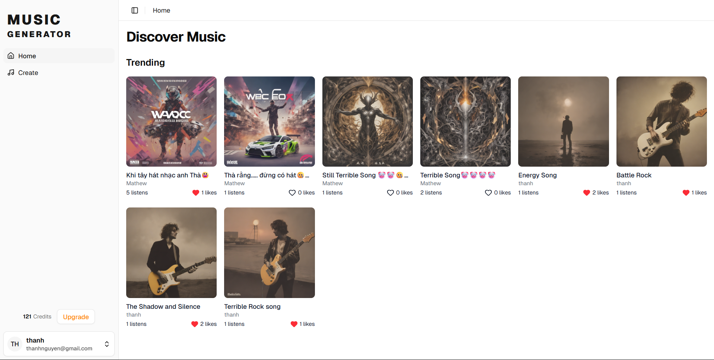

# AI Music Generation

<div align="center">
    
    
    
    
    
    
    
    
    
    
    
    
    
</div>          

## Overview
A SaaS application that generates original music using AI. The tool uses a state-of-the-art
music generation model to create songs from simple text descriptions, custom lyrics, or style prompts.
I have built a complete production-ready SaaS with user authentication, a credit-based payment system using Polar.sh,
and background processing queues to handle user load. All service used in this project are free, 
so you won't have to pay anything to follow along. I'll use tech stack such as Next.js 15, React, Typescript, Tailwind CSS,
ShadCN, BetterAuth, Polar, Python, FastAPI, Modal, Inngest, Neon, S3 on AWS, and more.

Features:
- 🎵 AI Music Generation with ACE-Step
- 🧠 LLM-Powered Lyrics & Prompt Generation with Qwen2-7B
- 🖼️ AI Thumbnail Generation with stabilityai/sdxl-turbo
- 🎤 Multiple Generation Modes for descriptions, custom lyrics, or described lyrics
- 🎸 Instrumental Tracks option to generate music without vocals
- ⚡ Serverless GPU Processing with Modal for fast generation
- 📊 Queue System with Inngest for handling generation tasks in background 
- 💳 Credit-Based System
- 💰 Polar.sh Integration for purchasing credit packs
- 👤 User Authentication with BetterAuth
- 🎧 Community Music Feed to discover, play, and like user-generated music
- 🎛️ Personal Track Dashboard to manage, play, and publish songs
- 🐍 Python & FastAPI Backend for music generation logic
- 📱 Modern UI with Next.js, Tailwind CSS & ShadCN UI

## Setup

Follow these steps to install and set up the project

**Clone the Repository**
```bash

```
